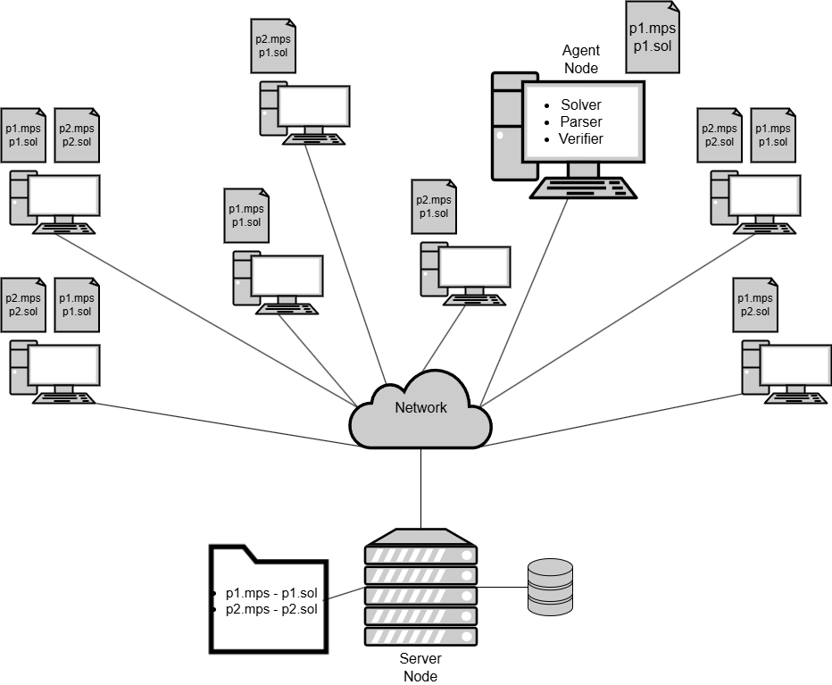

# Platform for a Distributed Optimization Solver

Python code of the implemented proof of concept made for my Master's Thesis project - Platform for a Distributed Optimization Solver. 

The implementation is a centralized version of the distributed optimization solver. Agent nodes compete to generate solutions to binary optimization problems. Server node is a web server with a database, and stores the problem instance and solution data on the platform. Agent nodes can access resources from the server node by making HTTP requests, for example download problem instances, submit solutions, and more.

    

 

Results from the experiments conducted for my thesis can be found in the `results/` folder. Analysis of the results can be found in the thesis report which were generated using the IPython notebook `results/analysis.ipynb`.

## Prerequisites

- Python **3.12+** (create virtual environment using `requirements.txt`)
- SQLite3

## Project structure

The project sturcture making up the implemented distributed optimization platform is as follows:

<pre>
├── network/        # Platform/network implementation
│   ├── agent_node.py              # Agent node class
│   ├── server_node.py             # Server node class
│   ├── server_node_web_server.py  # Server node initiation with a web server
│   └── network.params             # Runtime configuration parameters for agent nodes and server node
├── solver/         # Solver implementation
│   └── bip_solver.py      # Binary integer programming solver
├── database/       # Database implementation and setup
│   ├── schema.sql          # Database schema
│   ├── database_utils.py   # Database setup and teardown
│   └── data.sql            # Initial data in the database
├── data/miplib_problem_instances    # MIPLIB problem instances local storage
│   └── glass-sc.mps
├── experiments/    # Scripts for running experiments and storing experiment data
│   ├── run_experiments_local.sh                       # Run experiments locally
│   ├── agent_behavior_many_agents_single_problem.py   # Programmed agent behavior for multi-agent experiment
│   ├── agent_behavior_single_agent_single_problem.py  # Programmed agent behavior for single-agent experiment
│   ├── experiment_config.json                         # Experiment configuration settings
│   ├── experiment_data/      # Data generated during experiments (new subfolder generated for each experiment)
│   │   ├── experiment_2025-02-02_13-40-35/   # Timestamped experiment folder
│   │   │   ├── agents/   # Agent nodes data
│   │   │   │   ├── agent_1/
│   │   │   │   │   ├── problem_instances/        # Problem instances downloaded by agent
│   │   │   │   │   ├── best_platform_solutions/  # Best solutions downloaded from server node
│   │   │   │   │   └── best_self_solutions/      # Best solutions generated by agent
│   │   │   │   └── agent_2/    # (Same structure for other agents) 
│   │   │   ├── server/   # Server node data
│   │   │   │   ├── server_node.db     # Database
│   │   │   │   ├── best_solutions/    # Best solutions on platform, one for each problem instance
│   │   │   │   └── active_solutions/  # Active solutions on platform submitted by agents for solution validation phase
│   │   │   └── LOG.log   # Log file for the experiment
└── config.py       # Configuration settings (folder paths + web server host and port)
</pre>

#### *network/*
Here are the python class implementations of the agent and server nodes, `agent.py` and `server.py`. The server node is started with a web server in `server_node_web_server.py` that the agent nodes can communicate with using their class functions. The server node runs "forever" and only reacts to agent node requests. The agent nodes are programmed with a behavior that defines how they act on the platform (shown in the experiments folder). 

API documentation (Swagger) on the endpoints offered by the server node can be found at `localhost:8000/docs` when running the server node web server using `python -m network.server_node_web_server`.

The `network.params` file contains runtime configuration parameters for the agent nodes and server node. For example, the length of the solution validation phase managed by the server node.

#### *solver/*
Here is the implementation of the binary integer programming solver `bib_solver.py`. Each agent uses this solver class to parse, solve, and validate binary optimization problems.

#### *database/*
Here is the database schema in `schema.sql`, functions used for the database in `database_utils.py`, and the data which is inserted in the database on server node start up in `data.sql`. The database is used by the server node to store problem instances and solution data on the platform. Each time the server node is started, the database is created and populated with the initial data in a new database file stored in a newly created subfolder in  `experiments/experiment_data/`.

#### *data/miplib_problem_instances*
Here the MIPLIB problem instances used in the experiments are stored. I only include one instance in this repo out of all of the instances experimented on. To download more binary problem instances, visit the MIPLIB website (https://miplib.zib.de/tag_binary.html) and store them in this folder. Note that some instances with the binary tag are not exclusively only with binary variables.

#### *experiments/*
Here is the script for running the experiments `run_experiments_local.sh` and the programmed agent behavior for the experiments in `agent_behavior_single_agent_single_problem.py` and `agent_behavior_many_agents_single_problem.py`.

On start up of the server node, the server node creates the directories necessary for the experiments to run and writes those paths to the `experiment_config.json` file. It creates a folder each time it is started in the `experiments/experiment_data/` folder which is used to store runtime data used by both the server node and agent nodes. For the server node there is created a folder which contrains its database file, the best solutions found on the platform, and all active solutions in the solution validation phase submitted by agents. Agent nodes which should be started after the server node can access the paths from the json file. On startup, they create their own folders where they store store the data used during runtime: problem instances downloaded from the server node, best solutions downloaded from the server node, and best solutions generated by the agent.

## Run the platform - Experiments

The platform is run locally for the experiments (change web server host and port in `config.py`). It requires to start a single server node and one or more agent nodes. The server node is started with a web server in `server_node_web_server.py` that the agent nodes can communicate with. The agent nodes can be started in separate terminal windows or tabs. The agent nodes have to be programmed with a behavior that defines how they act on the platform, for example which problem instance they download and solve, how frequently they validate solutions, and more. The agent behavior used for the experiments is defined in `experiments/agent_behavior_single_agent_single_problem.py` and in `experiments/agent_behavior_many_agents_single_problem.py`. We note that for the experiments performed for the thesis, the agents node behavior is only programmed to solve one problem instance at a time. However, the platform is designed to handle multiple problem instances, both the server node and agent nodes. The agent nodes just need to be "told" to behave differently, for example by downloading multiple problem instances and solving them alternately.

To make it easier to run the platform for the experiments, a shell script `experiments/run_experiments_local.sh` is provided. The shell script starts the server node and agent nodes using the python programs previously mentioned. To select which problem instance to use in the experiments, change the *PROBLEM_INSTANCE* variable in the shell script. The length of the experiment can be set by changing the *TOTAL_TIME* variable in the shell script.

Before running the experiments, make sure to add the problem instances to the database table *problem_instances* in the `data/data.sql` file. The problem instances should be stored in the `data/miplib_problem_instances` folder.

#### Change solver
To switch between solvers, change the *solve()* function in the `solver/bip_solver.py` file. I only have two solver implemented, *generate_random_bip_solution_sample()* and *generate_random_bip_solution_heuristic()*, so for my experiments I just switch between these two by uncommenting the one I want to use in the *solve()* function.

If wanting to use another solver, it should be relatively easy to add a function similar to the existing ones in the `bip_solver.py` file. It should have the same input and output requirements as the existing solvers.

